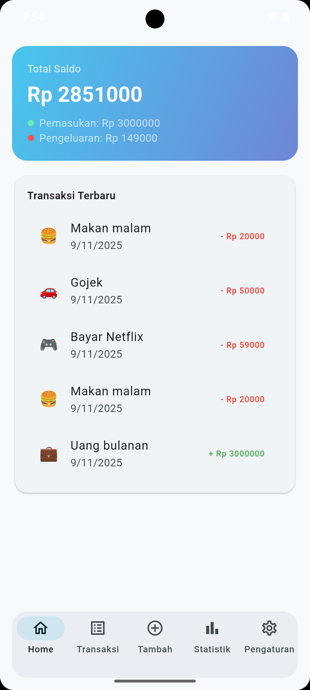
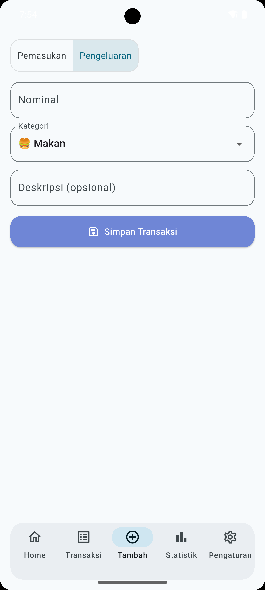
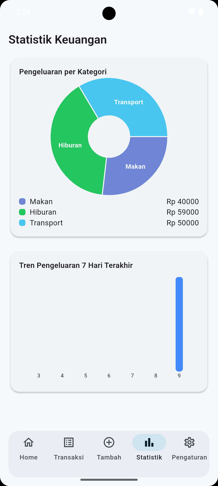
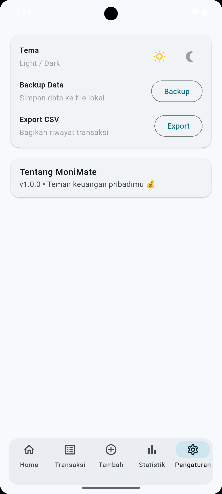
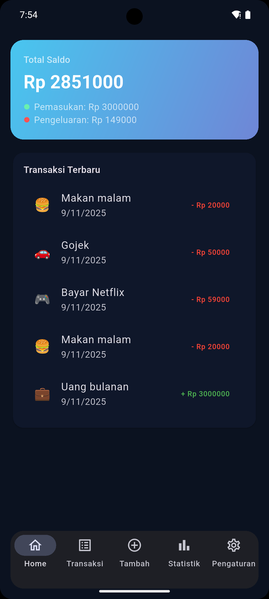
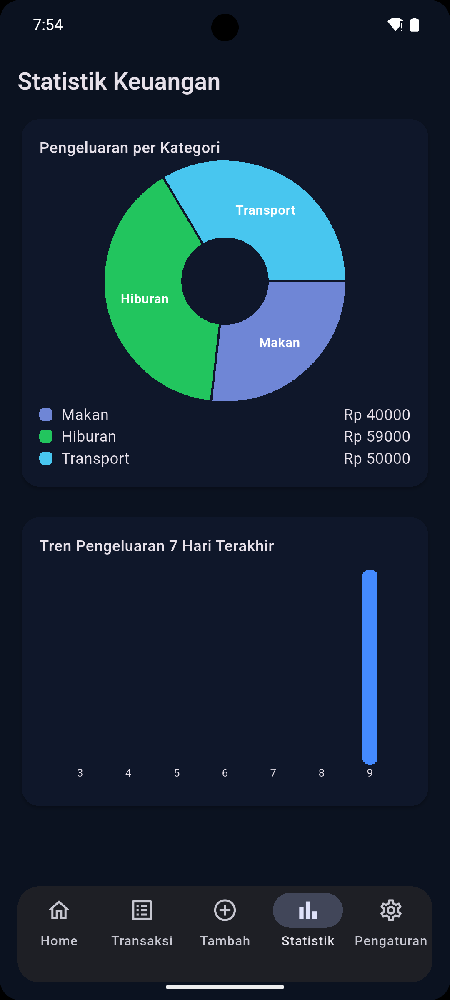
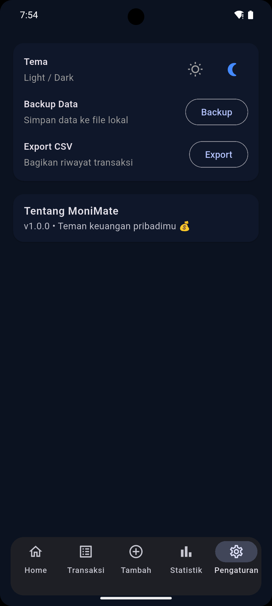

# 💰 MoniMate — Personal Finance Tracker (Offline)

> *Project iseng di waktu luang, tapi berasa fintech beneran 💸*

---

## 🧩 Deskripsi

**MoniMate** adalah aplikasi pencatat keuangan pribadi berbasis **Flutter**, yang bisa digunakan **sepenuhnya offline**.  
Didesain dengan gaya **modern fintech UI/UX** agar nyaman digunakan sehari-hari, ringan, dan tetap elegan di Light maupun Dark mode.

Aplikasi ini memudahkan pengguna untuk mencatat pemasukan dan pengeluaran, menampilkan statistik keuangan, serta melakukan backup ke file CSV tanpa koneksi internet.

---

## 🧠 Tujuan Project

- Melatih implementasi **offline-first architecture** (tanpa backend).
- Eksperimen dengan **GetX** untuk state management dan **Hive** untuk database lokal.
- Mendesain **UI fintech** yang clean, smooth, dan responsif.
- Membuat pondasi app keuangan pribadi yang bisa dikembangkan lebih lanjut.

---

## ⚙️ Tech Stack

| Komponen | Teknologi |
|----------|------------|
| Framework | Flutter (3.24+) |
| State Management | GetX |
| Local Database | Hive |
| Storage Preference | GetStorage |
| Chart Visualization | fl_chart |
| Export & Share | csv, share_plus |
| Font | Google Fonts (Poppins) |

---

## 🎨 UI / UX Highlight

- 🌊 **Ocean Toska Theme** — warna utama MoniMate (#48C6EF → #6F86D6)
- 🌗 **Dark & Light Mode** — dengan auto status bar brightness
- 🧭 **Rounded Bottom Navigation** — gaya fintech modern
- 🧾 **Empty State Elegan** — “Belum Ada Transaksi” dengan CTA interaktif
- 💡 **Responsive Layout** — cocok di berbagai ukuran layar

---

## 💼 Fitur Utama

✅ Tambah, edit, dan hapus transaksi harian  
✅ Klasifikasi transaksi (pemasukan / pengeluaran)  
✅ Statistik pengeluaran per kategori (Pie Chart & Bar Chart)  
✅ Mode Gelap & Terang dengan penyimpanan otomatis  
✅ Export CSV & Clear Data  
✅ Tampilan Empty State dengan ilustrasi  
✅ Desain fintech modern dan ringan

---

## 🧰 Struktur Proyek

lib/
┣ controllers/
┃ ┗ transaction_controller.dart
┣ data/
┃ ┗ models/
┃ ┗ transaction_model.dart
┣ pages/
┃ ┣ dashboard_page.dart
┃ ┣ transactions_page.dart
┃ ┣ add_page.dart
┃ ┣ stats_page.dart
┃ ┣ settings_page.dart
┃ ┗ shell.dart
┣ services/
┃ ┣ hive_service.dart
┃ ┗ export_service.dart
┣ theme/
┃ ┗ app_theme.dart
┗ main.dart


---

## 🧾 Preview (Screenshots)
## Versi Light Mode

| Dashboard | Add Transaksi | Statistik | Settings |
|------------|----------------|------------|------------|
|  |  |  |  |


## Versi Dark Mode

| Dashboard | Add Transaksi | Statistik | Settings |
|------------|----------------|------------|------------|
|  |  |  |  |

> 📸 *Ganti dengan screenshot asli setelah build release.*

---

## 🚀 Rencana Pengembangan

- 📆 Filter transaksi berdasarkan tanggal & kategori  
- 📊 Laporan bulanan otomatis di Dashboard  
- 🗂️ Import CSV (restore backup)  
- 🔔 Notifikasi harian “Catat pengeluaranmu hari ini!”  
- 🧭 Onboarding screen & splash logo MoniMate  
- 🔐 Keamanan (PIN / biometric lock)  
- ☁️ Sinkronisasi ke cloud (Firebase / Supabase)

---

## 🧠 Insight Dev

> “Project iseng di waktu luang, tapi siapa tahu bisa bantu orang lain mengatur keuangannya.”  
> — **Bang Jay**

---

## 👨‍💻 Dibuat oleh

**Zainal Salamun (Bang Jay)**  
Android & Flutter Developer  
💼 7+ tahun pengalaman di Android, Kotlin, & Flutter  
🌍 Indonesia  
📬 [LinkedIn](https://linkedin.com) • [Threads](https://www.threads.net)  

---

## 🏷️ Tagline

> **MoniMate** — *Teman keuangan pribadimu, selalu siap bahkan tanpa internet.*

---

## 🛠️ Flutter Info


---

## 📦 Cara Menjalankan

```bash
# Clone project
git clone https://github.com/yourusername/monimate.git

# Masuk ke folder
cd monimate

# Install dependency
flutter pub get

# Jalankan app
flutter run
