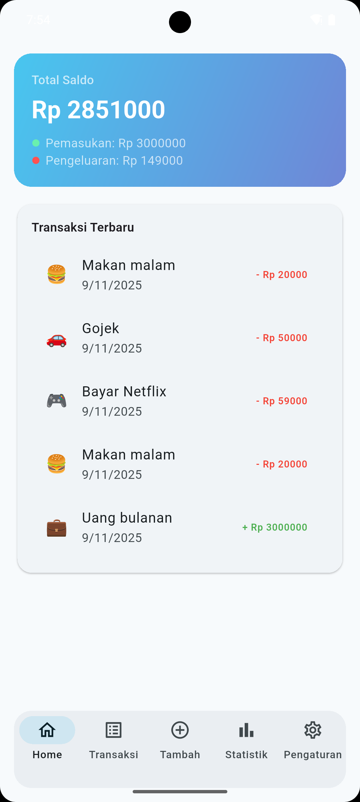
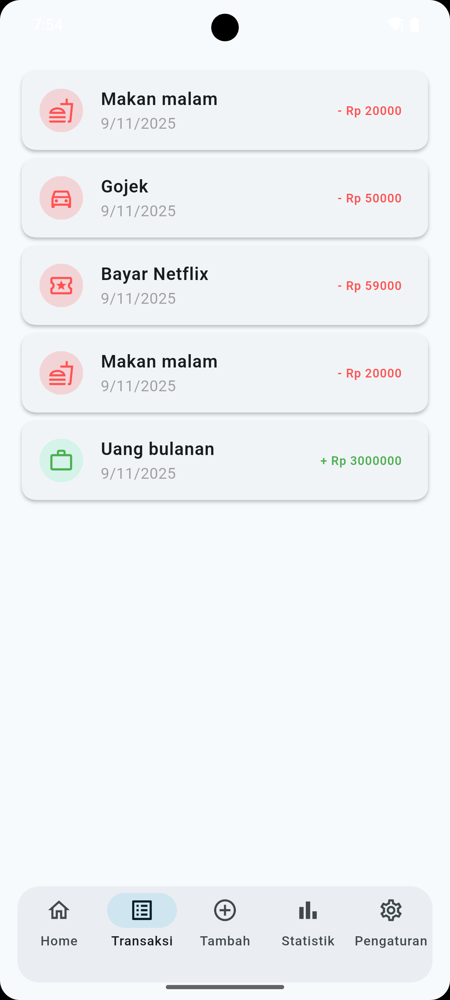
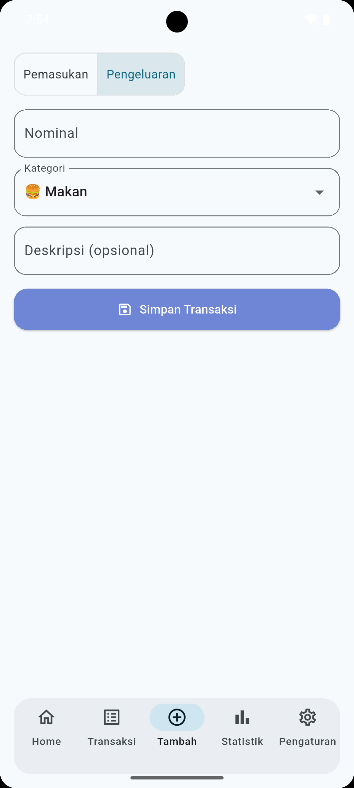
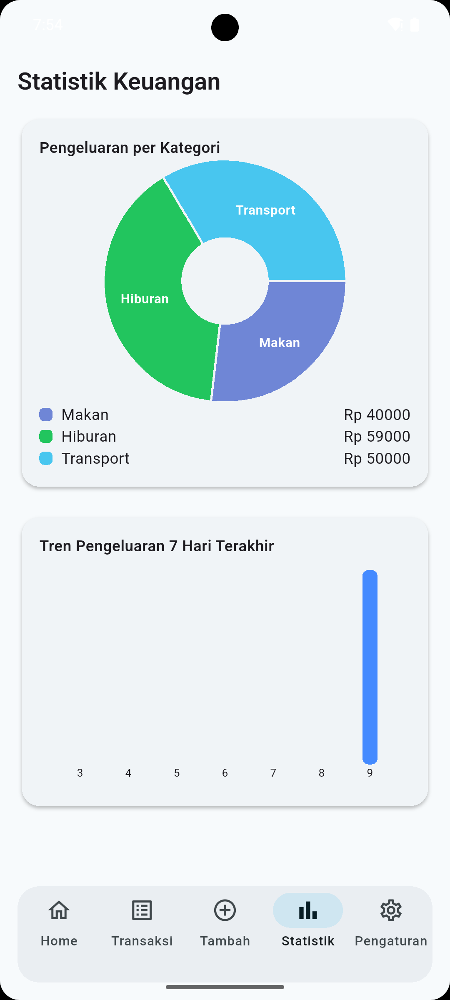
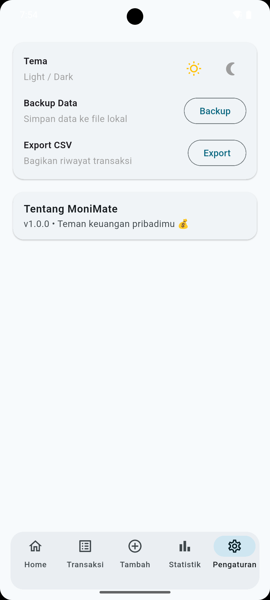
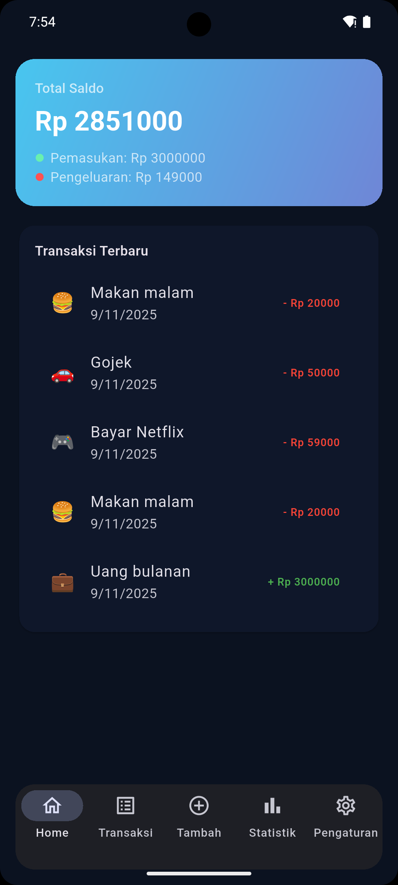
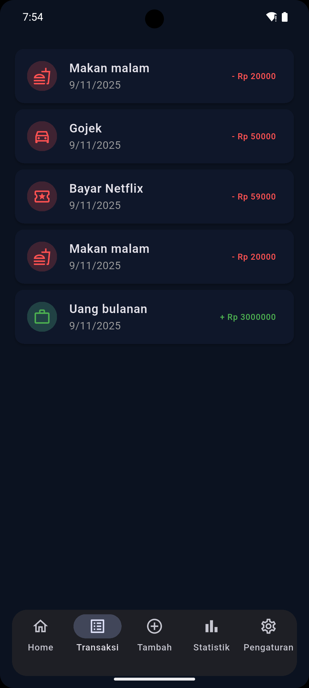
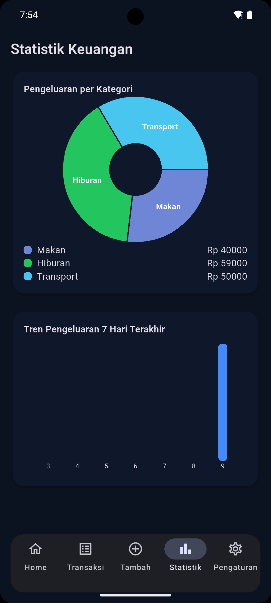

# 💰 MoniMate — Personal Finance Tracker (AI Powered)

> Kelola keuanganmu dengan cerdas, bahkan tanpa koneksi internet.

---

## 🌟 Deskripsi

**MoniMate** adalah aplikasi pencatat keuangan pribadi berbasis **Flutter** yang mengutamakan privasi dengan pendekatan **offline-first**. Aplikasi ini didesain dengan antarmuka **Fintech Modern** yang elegan, mendukung Light/Dark mode, dan kini dilengkapi dengan teknologi **AI Receipt Scanner** untuk pencatatan transaksi yang super cepat.

Aplikasi ini memudahkan pengguna untuk:
1. Mencatat pemasukan dan pengeluaran secara manual maupun otomatis via Hybrid AI (Gemini + ML Kit).
2. Memantau kesehatan keuangan melalui grafik statistik yang interaktif dan dashboard modern.
3. Melakukan backup data ke file CSV.
4. Menjalankan fungsi utama secara offline (dengan dukungan AI cerdas saat online).

---

## 🔥 Fitur Unggulan

- 🧠 **Hybrid AI Receipt Scanner** — Scan struk belanja menggunakan kamera. Menggunakan **Google Gemini API** untuk ekstraksi data dengan akurasi tinggi (nominal dan nama merchant), dan otomatis *fallback* ke **Google ML Kit** (offline) jika terjadi masalah koneksi atau limit API. Hasil scan dapat di-review dan diedit sebelum disimpan.
- 💳 **Multi Wallet System** — Mengelola dompet ganda dengan mudah. Dukungan untuk berbagai jenis akun seperti Tunai (Cash), Bank, dan E-Wallet dengan perhitungan akumulasi kekayaan otomatis.
- 🎯 **Smart Budgeting** — Atur budget bulanan per kategori. Pantau penggunaan secara real-time dengan progress bar interaktif:
  - 🟢 < 70%: Hemat (Ocean Toska)
  - 🟠 70-90%: Waspada (Orange)
  - 🔴 > 90%: Bahaya (Red + Shake Animation)
- 🔒 **Strict Mode** — Fitur keamanan finansial level pro yang mencegah pencatatan transaksi jika sudah melebihi budget yang ditentukan.
- 📈 **Net Worth Dashboard** — Pantau perkembangan nilai kekayaan bersih harian secara *real-time* lewat grafik yang indah dan informatif.
- 🏥 **Financial Health Score** — Sistem skoring pintar otomatis (0-100) yang mengevaluasi kesehatan finansial berdasarkan tabungan, dana darurat, profil pengeluaran, dan stabilitas pendapatan bulanan.
- 🛡️ **Emergency Fund Tracker** — Hitung dan pantau kebutuhan dana darurat berdasarkan profil status (Single, Married, Freelance). Memberikan progres real-time untuk mencapai ketahanan finansial.
- 💡 **AI Financial Insights & Predictive Coach** — Analisis otomatis perilaku keuangan (analisis akhir pekan, tren pengeluaran bulanan) dan saran prediksi jika budget hampir habis atau dana darurat kritis.
- 🤖 **Gemini AI Chat Assistant** — Asisten keuangan *smart chat* berbasis Google Gemini yang siap membantu menjawab pertanyaan finansialmu atau menganalisa riwayat pengeluaran secara personal.
- 🕒 **Recurring Transactions** — Otomatisasi pencatatan tagihan rutin atau pendapatan berkala (gaji, bonus) untuk kemudahan jangka panjang.
- 📑 **Monthly Financial Report** — *Generate* laporan keuangan bulanan lengkap berbentuk PDF atau Gambar beresolusi tinggi. Mendukung logo kustom dan layout laporan siap-cetak.
- 🔔 **Smart Alerts** — Notifikasi lokal otomatis yang mengingatkanmu saat pengeluaran mencapai 80% dan 100% dari limit.
- 🏆 **Achievements & Gamification** — Sistem pencapaian yang memotivasi pengguna untuk mencapai target keuangan. Kumpulkan badge dan lacak progres pencapaianmu.
- 🌊 **Modern Fintech UI** — Antarmuka premium dengan kombinasi warna *Ocean Toska* (`#0288D1` & `#4FC3F7`), pemformatan Rupiah otomatis (`Rp. 1.000.000`), animasi Lottie yang halus, dan layout responsif untuk pengalaman pengguna yang maksimal.
- 📊 **Smart Statistics** — Visualisasi pengeluaran bulanan menggunakan *Pie Chart* dan tren mingguan dengan *Bar Chart*.
- 🌓 **Dynamic Theme** — Dukungan penuh untuk Mode Terang (Light) dan Mode Gelap (Dark) dengan transisi yang mulus.
- 📅 **Calendar View** — Lihat riwayat transaksi berdasarkan tanggal dengan mudah lewat antarmuka kalender interaktif menggunakan `table_calendar`.
- 🎯 **Financial Goals** — Tetapkan dan pantau target keuangan (seperti menabung untuk liburan, gadget baru, dll) dengan visualisasi progres yang intuitif.
- ☁️ **Cloud Sync** — Sinkronisasi otomatis (Auto Sync) ke Google Drive. Pindah device tanpa kehilangan data dan app tetap berfungsi saat offline. Dilengkapi **connectivity monitoring** untuk deteksi status jaringan secara real-time.
- 🔒 **Privacy Focused** — Data disimpan secara lokal menggunakan database Hive yang cepat dan aman.
- 📤 **Data Export & Share** — Ekspor seluruh riwayat transaksi ke format CSV untuk keperluan laporan eksternal, atau bagikan langsung ke aplikasi lain.
- 📱 **Cross-Platform (iOS & Android)** — Dukungan penuh untuk kedua platform dengan UI yang optimal di masing-masing.
- 🎬 **Branded Splash Screen** — Splash screen kustom dengan logo MoniMate menggunakan `flutter_native_splash`.

---

## ⚙️ Tech Stack

| Komponen | Teknologi |
|----------|------------|
| **Core Framework** | Flutter (3.24+) |
| **State Management** | GetX |
| **Local Database** | Hive |
| **AI Engine** | Google Gemini API & Google ML Kit (Text Recognition) |
| **Local Notifications** | flutter_local_notifications |
| **Animation & Feedback** | confetti, vibration, Lottie |
| **Charts** | fl_chart |
| **Calendar** | table_calendar |
| **State Persistence** | GetStorage |
| **Cloud Sync** | googleapis, google_sign_in, connectivity_plus |
| **Image & Camera** | image_picker, camera |
| **Data Export & Share** | csv, share_plus |
| **Environment Config** | flutter_dotenv |
| **Splash Screen** | flutter_native_splash |
| **SVG Rendering** | flutter_svg |
| **UI Components** | Google Fonts (Outfit), Lucide Icons |

---

## 🧰 Struktur Proyek

| Folder | Deskripsi |
| --- | --- |
| `lib/features/budget/` | Sistem budget pintar, AI insights engine, dan UI monitoring budget. |
| `lib/features/financial_goals/` | Pengelolaan target keuangan, kontribusi, achievements, dan visualisasi progres tabungan. |
| `lib/data/models/` | Model data (Transaction, Category, Goal, Contribution, RecurringTransaction, Budget) dengan Hive TypeAdapters. |
| `lib/data/controller/` | Controller utama: TransactionController, ThemeController, RecurringController, SyncController. |
| `lib/data/services/` | Layanan: HiveService, NotificationService, ExportService, ReceiptScannerService, SyncService, SeederService. |
| `lib/pages/` | Halaman utama: Dashboard, Stats, Calendar, Add Transaction, Recurring Manager, Sync, Settings, Receipt Scanner & Review. |
| `lib/theme/` | Konfigurasi tema warna, gradasi, dan gaya teks aplikasi. |
| `lib/utils/` | Fungsi format mata uang, tanggal, icon kategori, dan helper pembersihan teks. |

---

## 🧾 Preview (Screenshots)

Versi Light & Dark Mode
<table> 
  <tr> 
    <td></td> 
    <td></td> 
    <td></td> 
    <td></td> 
  </tr> 
  <tr> 
    <th>Dashboard</th> <th>Daftar Transaksi</th> <th>AI Scanner / Add</th> <th>Statistik</th> 
  </tr> 
  <tr> 
    <td></td>
    <td></td>
    <td></td>
    <td></td>
  </tr>
  <tr>
    <th>Settings</th> <th>Dashboard (Dark)</th> <th>Daftar (Dark)</th> <th>Statistik (Dark)</th>
  </tr>
</table>

---

## 👨‍💻 Kontributor

**Zainal Salamun**  
Android & Flutter Developer  
💼 7+ tahun pengalaman di ekosistem Mobile Development.  
🌍 Indonesia  
📬 [LinkedIn](https://www.linkedin.com/in/zainal-salamun-660a9598/) • [Threads](https://www.threads.com/@zainalsalamun)

---

## 🛠️ Cara Menjalankan

1. **Clone & Install**:
   ```bash
   git clone https://github.com/zainalsalamun/moni_mate_flutter
   cd moni_mate_flutter
   flutter pub get
   ```

2. **Jalankan Aplikasi**:
   ```bash
   flutter run
   ```

3. **Build APK untuk Android**:
   ```bash
   # Build APK Universal (ukuran lebih besar)
   flutter build apk --release

   # Build APK terpisah berdasarkan arsitektur (ukuran lebih kecil dan efisien)
   flutter build apk --split-per-abi

   # Build APK untuk arsitektur spesifik (contoh: ARM64 untuk HP modern)
   flutter build apk --target-platform android-arm64 --release
   ```

4. **Build AppBundle (AAB) untuk Google Play Store**:
   ```bash
   flutter build appbundle --release
   ```

5. **Build iOS (IPA) untuk App Store**:
   ```bash
   flutter build ipa --release
   ```

---

## 🏷️ Tagline

> **MoniMate** — *Teman cerdas finansialmu, kapan saja, di mana saja, bahkan tanpa sinyal.*
